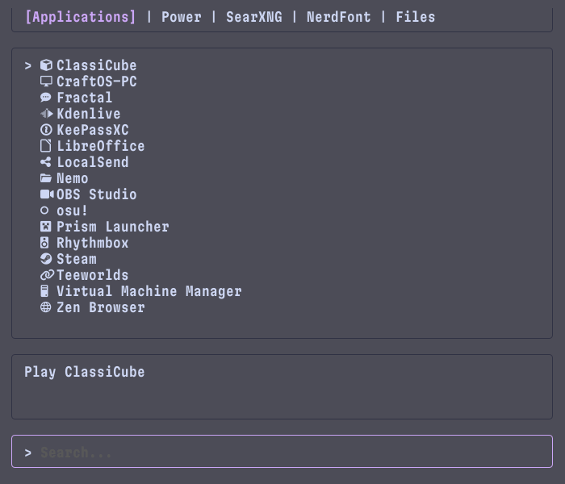

# spyglass



[](https://deepwiki.com/StikyPiston/spyglass)

**spyglass** is an extensible TUI search tool written in *Go*, inspired by [Raycast](https://raycast.com) and [Vicinae](https://vicinae.com)

## Installation

### with Nix

Simply add the repo to your flake inputs...

```nix
inputs = {
  spyglass.url = "github:stikypiston/spyglass";
};
```

...and pass it into your `environment.systemPackages`...

```nix
environment.systemPackages = [
  inputs.spyglass.packages.${pkgs.stdenv.hostPlatform.system}.spyglass
];
```

### with Go

Simply run the following command:

```shell
go install github.com/stikypiston/spyglass@latest
```

> [!NOTE]
> Ensure that `~/go/bin` is in your $PATH

## Basic Navigation

- Type to search
- Use `Tab` to switch Lenses (tabs)
- Use `Up/Down` to select results
- Use `Shift+Tab` to open the Context Menu

## Documentation

For instructions on how to configure the default `Applications` lens, how to register new lenses, and how to create your own lens, see the [documentation home](/docs/home.md)
